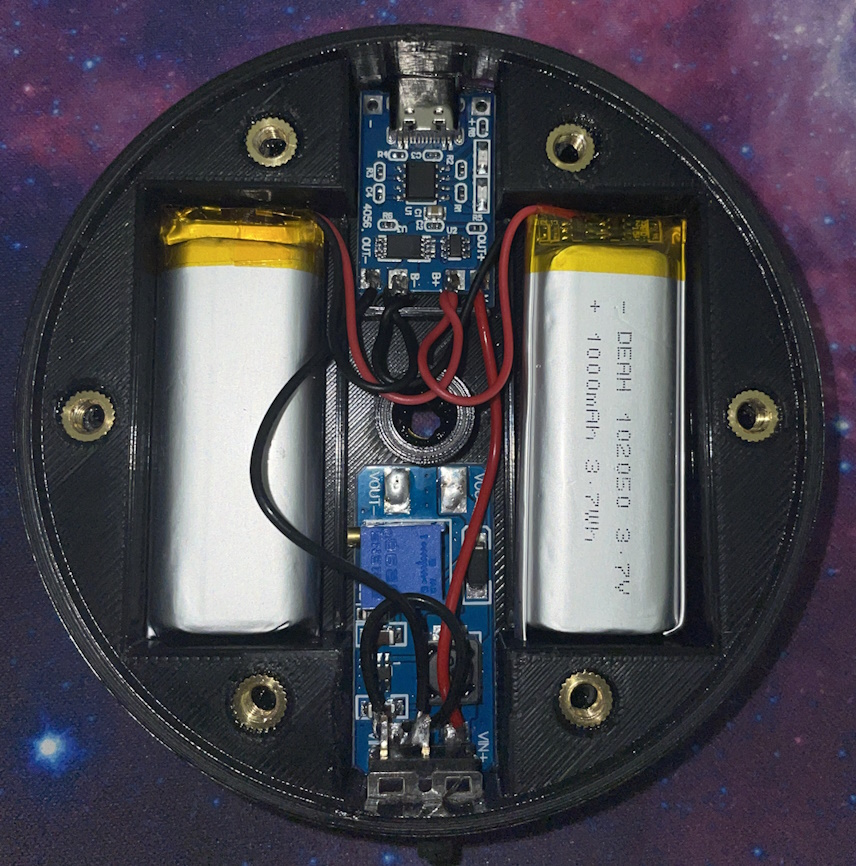

# Instructions
Here's how you can build your own Vive Tracker Battery Bank.

## Printing

Case

Lid

Print with 15-20% Infill. No supports. PLA is fine.

## Case Prep

TBA.

## Wiring

2x 1000mAh batteries connected in parallel > TP4056 Charging Module > Step Up Converter (Set to 5V Out) > Switch > Copper Contacts (Inserted through the lid)

Diagram TBA.

## Securing the Components

Hot glue the switch, charging module, and step-up converter into place. Batteries will be secured with VHB tape adhered to the bottom of the case.

## Attaching the Tracker

Insert a long thin philips screwdriver into the thread insert hole at the bottom of the battery bank to screw the mounting screw into the tracker.